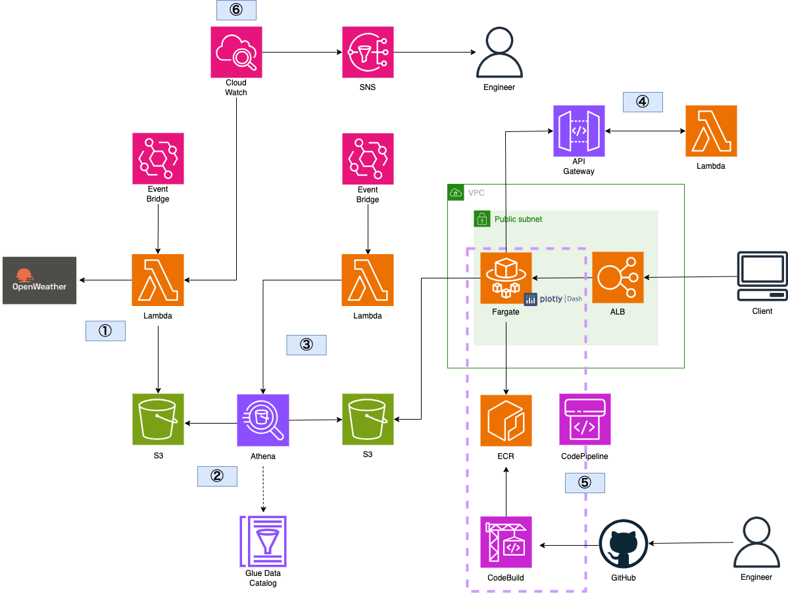

# Fargate + Dashによるダッシュボードアプリのケーションの実装

## 概要
以下の構成のダッシュボードアプリケーションを構築する。

## リポジトリの構成
**Docker image 構築用資材**  
* `Dockerfile`
  * コンテナイメージ作成用ファイル
* `mnt/requirements.txt`
  * コンテナにインストールするpythonパッケージリスト
* `mnt/execute.sh`  
  * コンテナ起動時に実行するスクリプト

**Lambda関数のコード**
* `lambda/get_info.py`
  * Open Wheahter API から天気予報情報を取得するためのコード
* `lambda/update_data.py`
  * Dash が参照するデータを更新するためのコード

**ダッシュボード構築用資材**
* `mnt/run.py`
  * Dash 起動用コード
* `mnt/pages/`  
  * 各ページのレイアウトなどを定義しているファイル
* `mnt/assets/style.css`
  * ナビゲーションバーのスタイルを変更するためのファイル
* `mnt/module/boto3.py` 
  * S3からcsvファイルを取得するためのモジュール
