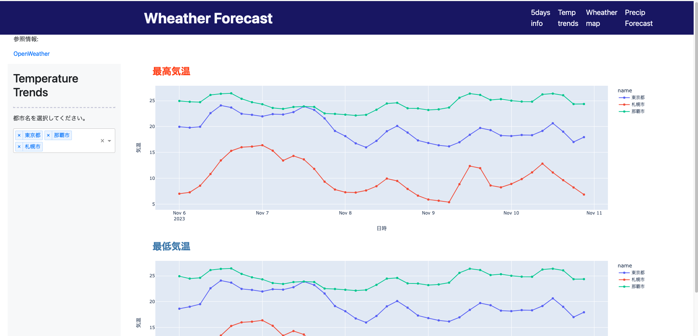

# Fargate + Dashによるダッシュボードアプリケーションの実装

## 目標
世界中の天気予報情報を無料で取得できる [Open Weather API](https://openweathermap.org/) から情報を取得し、日本のいくつかの都市について天気情報を確認できるダッシュボードを構築すること。

  
## 構成図

1. EventBridgeをトリガーに毎日指定時刻になったらOpen Weather APIから天気予報情報(json形式)を取得しS3に格納。

2. Athenaを用いてS3のjsonファイルからスキーマ, ビューを作成し、Glueデータカタログに登録する。

3. 1とは別のEventBridgeルールをトリガーに毎日指定時刻になったらダッシュボードに表示するための最新情報を取得しS3に格納。

4. GitHubにコードがPushされると、  
「Dockerイメージのビルド → ECRへのPush → Fargateへのデプロイ」  
までが自動で実行される。  
Fargate上で稼働しているDashアプリケーションは3.で取得した情報の格納先S3バケットを参照する。

※. 1. で実行したLambda関数のエラー率が閾値を超えた場合に、CloudWatchから管理者にアラートが発報される。

## リポジトリの構成
**Docker image 構築用資材**  
* `Dockerfile`
  * コンテナイメージ作成用ファイル
* `mnt/requirements.txt`
  * コンテナにインストールするpythonパッケージリスト
* `mnt/execute.sh`  
  * コンテナ起動時に実行するスクリプト

**Lambda関数のコード**
* `lambda/get_info.py`
  * Open Wheahter API から天気予報情報を取得するためのコード
* `lambda/update_data.py`
  * Dash が参照するデータを更新するためのコード

**ダッシュボード構築用資材**
* `mnt/run.py`
  * Dash 起動用コード
* `mnt/pages/`  
  * 各ページのレイアウトなどを定義しているファイル
* `mnt/assets/style.css`
  * ナビゲーションバーのスタイルを変更するためのファイル
* `mnt/module/boto3.py` 
  * S3からcsvファイルを取得するためのモジュール
